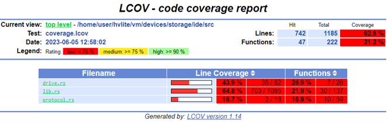

# Running Fuzzers Locally

## Installing Dependencies

To begin fuzzing in OpenVMM, you'll need to install `cargo-fuzz` and a nightly
rust compiler.

Installation should be as simple as:

```bash
rustup install nightly
cargo install cargo-fuzz
```

> NOTE: `cargo-fuzz` requires a nightly toolchain as it compiles targets with
> [ASAN](https://learn.microsoft.com/en-us/cpp/sanitizers/asan?view=msvc-170) to
> improve the likelihood of finding bugs and the reproducibility of testcases.

## Running

While its entirely possible to run the various fuzzers in the OpenVMM repo using
`cargo fuzz` directly, the OpenVMM repo includes additional tooling to streamline
working with fuzzers at "OpenVMM scale": `cargo xtask fuzz`

`cargo xtask fuzz` bridges the gap between `cargo fuzz`'s "crate-oriented"
tooling, and OpenVMM's "repo-oriented" tooling.

e.g: instead of manually navigating to each individual `crate/fuzz` directory in
order to use `cargo fuzz`, with `cargo xtask fuzz`, you can list/run/build _any_
fuzzer in the OpenVMM repo, regardless where it happens to be in the repo!

Before you can run a fuzzer, you need to know its name. To see a list of all
fuzzers currently in the OpenVMM tree, you can run:

```bash
cargo xtask fuzz list
```

The output will be a list of available "fuzz targets":

```
$ cargo xtask fuzz list
fuzz_chipset_battery
fuzz_ide
fuzz_scsi_buffers
```

Once you've got a fuzzer you're interested in running (e.g: `fuzz_ide`),
starting a fuzzing session is as easy as running:

```bash
cargo xtask fuzz run fuzz_ide
```

And you're off! If you see a whole bunch of terminal spew, congrats, you're
fuzzing!

When run locally using the above command, the fuzzer will run indefinitely until
a crash is discovered.

If you need to tweak the runtime behavior of the command, all of libFuzzer's
[commandline options][cli-opts] are at your disposal. Alternatively you can
print the help of the fuzzer like so:

```bash
# NOTE: The "-- --" is required to differentiate between `xtask fuzz`'s
# extra-args, and `cargo fuzz`'s extra-args
cargo xtask fuzz run fuzz_ide -- -- -help=1
```

[cli-opts]: https://www.llvm.org/docs/LibFuzzer.html#options
[toolchain-overrides-url]: https://rust-lang.github.io/rustup/overrides.html

## Other Fuzzing Commands

The `cargo xtask fuzz` CLI includes plenty of docs via `--help` text. Don't be
afraid to dig into all the tools available via `cargo xtask fuzz` by using
`--help` at both the top-level, and for more details regarding the various
subcommands.

Note that most `cargo xtask fuzz` commands mirror those from `cargo fuzz`, so
for additional information on how certain commands work, check out the
[cargo-fuzz book](https://rust-fuzz.github.io/book/cargo-fuzz.html).

## Coverage

The effectiveness of fuzzing can be measured with code coverage.

Code coverage can be analyzed to determine which branches in the target were
exercised and which were missed by the fuzzer. This can be used to determine if
the fuzzer needs improvements or is doing an adequate job.

Before you begin you'll need some additional dependencies to generate an html
report:

```bash
rustup +nightly component add llvm-tools
apt install lcov
```

To generate a report with "sane defaults", you can simply run:

```bash
cargo xtask fuzz coverage fuzz_ide --with-html-report
```

Simply navigate to the `html/report/dir/index.html`` on your machine and inspect the coverage!



> NOTE: `--with-html-report` offers a quick-and-easy way for an individual user
> generate a coverage report locally, but it may not be entirely appropriate for
> more "industrial scale" fuzzing pipelines.

### Manual Coverage Generation (Advanced)

The basic way this is done is by running all the discovered input testcases
through the fuzzer and merging all the coverage events together (remember, the
fuzzers only save testcases which generate new coverage). Cargo-fuzz provides a
way to do this with the `coverage` subcommand. This step generates a
`coverage.profdata` file which can be turned into a human-readable HTML report:

```bash
# cargo xtask fuzz coverage <fuzzer name>
cargo xtask fuzz coverage fuzz_ide
# confirm coverage.profdata was created
ls -l coverage.profdata
```

OR if you have a large number of inputs (5k+) the below will collect and merge
coverage significantly faster:

```bash
# rebuild the fuzzer with coverage instrumentation
RUSTFLAGS="-C instrument-coverage" cargo +nightly fuzz build
# set env var to rustup's llvm-preview tools
LLVM_TOOLS_PATH=$(dirname $(find $(rustc +nightly --print sysroot) -name 'llvm-profdata'))
# make an output directory for corups minimation
mkdir min_corp
# run the minimizer putting the raw cov data into coverage.profraw
LLVM_PROFILE_FILE="coverage.profraw" ./fuzz/targets/<target-path>/release/fuzz_ide min_corp <path to input corpus directory> -merge=1
# merge the raw data into coverage.profdata
$LLVM_TOOLS_PATH/llvm-profdata merge -sparse coverage.profraw -o coverage.profdata
```

Next find the location of the llvm-tools you installed with rustup
(NOTE: rustup is used to install the LLVM tools to ensure that rust's llvm
version and the tool version are in sync), and convert the coverage data into
a report:

```bash
# set env var to rustup's llvm-preview tools
LLVM_TOOLS_PATH=$(dirname $(find $(rustc +nightly --print sysroot) -name 'llvm-profdata'))
# covert the coverage data into an lcov format
$LLVM_TOOLS_PATH/llvm-cov export -instr-profile=coverage.profdata \
    -format=lcov \
    -object ./fuzz/targets/<target-triple>/coverage/<target-triple>/release/fuzz_ide \
    --ignore-filename-regex "rustc" > coverage.lcov
# summarize the coverage information
lcov --summary ./coverage.lcov
# make an output directory for the html report
mkdir -p lcov_html
# generate the html report
genhtml -o lcov_html --legend --highlight ./coverage.lcov
```
