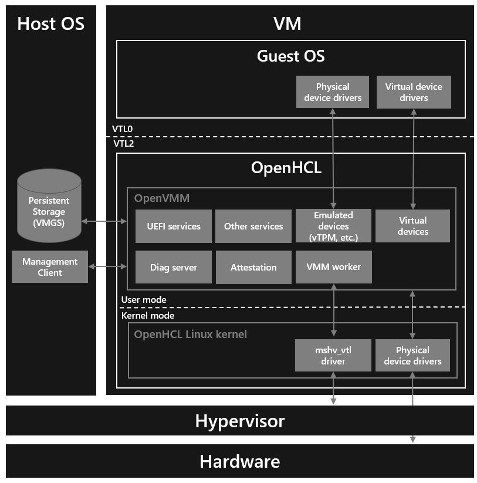
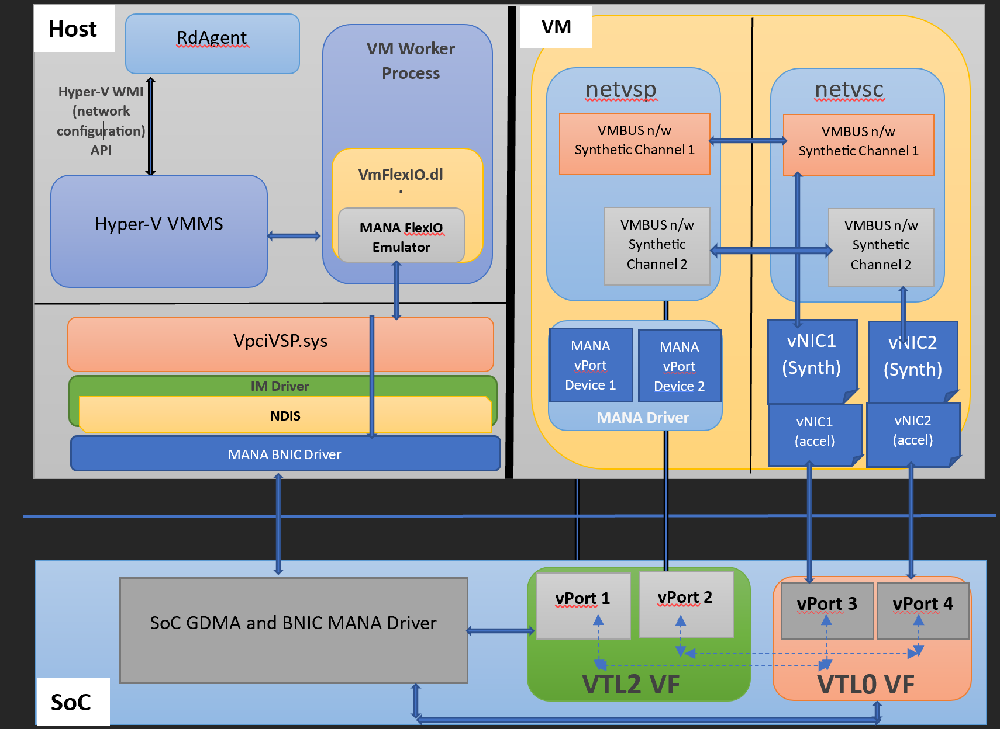

# OpenHCL Architecture

**Prerequisites:**

- [Getting Started: OpenHCL](../../user_guide/openhcl.md).
- [Architecture: OpenVMM Architecture](./openvmm.md).

* * *

> This page is under construction

## Overview

The following diagram offers a brief, high-level overview of the OpenHCL
Architecture.

## VTLs

OpenHCL currently relies on Hyper-V's implementation of [Virtual Trust Levels]
(VTLs) to implement the security boundaries necessary for running OpenVMM as a
paravisor.

VTLs can be backed by:

- Hardware-based [TEEs], like Intel [TDX] and AMD [SEV-SNP]
- Software-based constructs, like Hyper-V [VSM]

OpenHCL runs within VTL2[^sk], and provides virtualization services to a Guest OS
running in VTL0.

## OpenHCL Linux

By building on-top of Linux, OpenHCL is able to leverage the extensive Linux
software and development ecosystem, and avoid re-implementing various components
like core OS primitives, device drivers, and software libraries. As a result:
OpenHCL provides a familiar and productive environment for developers.

The OpenHCL Linux Kernel uses a minimal kernel configuration, designed to host a
single specialized build of OpenVMM in userspace.

In debug configurations, userspace may include additional facilities (such as an
interactive shell, additional perf and debugging tools, etc). Release
configurations use a lean, minimal userspace, consisting entirely of OpenHCL
components.

* * *

## Scenario: Azure Boost Storage/Networking Translation

Traditionally, Azure VMs have used Hyper-V VMBus-based synthetic networking and
synthetic storage for I/O. Azure Boost introduces hardware accelerated storage
and networking. It exposes different interfaces to guest VMs for networking and
storage. Specifically, it exposes a new proprietary [Microsoft Azure Network
Adapter] (MANA) and an NVMe interface for storage.

OpenHCL is able to provide a compatibility layer for I/O virtualization on
Azure Boost enabled systems.

Specifically, OpenHCL exposes Hyper-V VMBus-based synthetic networking and
synthetic storage for I/O to the guest OS in a VM. OpenHCL then maps those
synthetic storage and networking interfaces to the hardware accelerated
interfaces provided by Azure Boost.

The following diagram shows a high level overview of how synthetic networking is
supported in OpenHCL over Microsoft Azure Network Adapter (MANA)

  

The following diagram shows a high level overview of how accelerated networking
is supported in OpenHCL over MANA

    

[^sk]: Why not VTL1? Windows already uses VTL1 in order to host the [Secure Kernel].

[VSM]: https://learn.microsoft.com/en-us/virtualization/hyper-v-on-windows/tlfs/vsm
[Virtual Trust Levels]: https://learn.microsoft.com/en-us/virtualization/hyper-v-on-windows/tlfs/vsm
[TDX]: https://www.intel.com/content/www/us/en/developer/tools/trust-domain-extensions/overview.html
[SEV-SNP]: https://www.amd.com/content/dam/amd/en/documents/epyc-business-docs/white-papers/SEV-SNP-strengthening-vm-isolation-with-integrity-protection-and-more.pdf
[TEEs]: https://en.wikipedia.org/wiki/Trusted_execution_environment
[Secure Kernel]: https://www.microsoft.com/en-us/security/blog/2020/07/08/introducing-kernel-data-protection-a-new-platform-security-technology-for-preventing-data-corruption/
[Microsoft Azure Network Adapter]: https://learn.microsoft.com/en-us/azure/virtual-network/accelerated-networking-mana-overview
