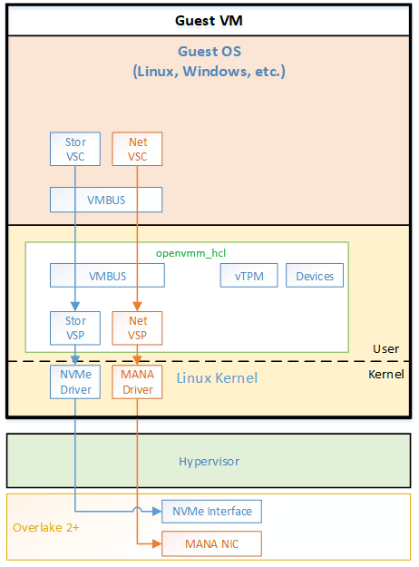

# OpenHCL

TODO OSS: this entire introduction needs to be rewritten, and diagrams will need to
be replaced

* * *

OpenHCL is an environment for running virtualization facilities inside of
a guest virtual machine rather than in the privileged host/root partition.
The project was originally codenamed Underhill so you may see some
references to this name in the documentation and code.
This provides three primary benefits:

* Host Resource Usage Reduction - the OpenHCL environment shares resources
    with the guest virtual machine. So, any resources used for OpenHCL come
    from the guest virtual machine's resource allotment rather than from the
    host partition's resources.
* Host Attack Surface Reduction - by running virtualization facilities inside
    of the guest virtual machine, security vulnerabilities are isolated to the
    guest virtual machine and thus limit the blast radius to the single guest
    virtual machine rather than the multi-tenant virtualization host.
* Guest Confidentiality - in confidential computing scenarios, guest assets are
    intended to be protected from the host. Since OpenHCL is part of a guest, it
    is isolated from the host for confidential VMs and thus can be safely used to
    confidentially offload virtualization functionality that must operate on customer
    plain text data.

OpenHCL leverages virtual secure mode technology provided by the Azure hypervisor
to enable an alternate execution environment to run inside of a guest virtual machine.
Thus, OpenHCL is isolated from the rest of the operating system running inside of
the guest virtual machine.

OpenHCL runs a minimal Linux kernel with a few user-mode applications to provide
virtualization services to the guest OS in the virtual machine. This user-mode
application is the OpenVMM Rust-based VMM.

Below is a high level overview diagram of OpenHCL
    

# Scenarios
The primary scenario for OpenHCL is to provide a compatibility layer for I/O
virtualization on Overlake 2+ enabled systems. Traditionally, Azure VMs have
used Hyper-V vmbus-based synthetic networking and synthetic storage for I/O.

Overlake 2 introduces hardware accelerated storage and networking. It exposes
different interfaces to guest VMs for networking and storage. Specifically,
it exposes a new proprietary Microsoft network interface for networking (MANA)
and a NVMe interface for storage.

OpenHCL can be used to provide a compatibility interface for storage and
networking for VMs on Overlake. Specifically, OpenHCL exposes Hyper-V
vmbus-based synthetic networking and synthetic storage for I/O to the guest OS
in a VM. OpenHCL then maps those synthetic storage and networking interfaces
to the hardware accelerated interfaces provided by Overlake.

Below diagram shows a high level overview of how synthetic networking is supported
in OpenHCL over Microsoft Azure Network Adapter (MANA)  
  

Below diagram shows a high level overview of how accelerated networking is supported
in OpenHCL over MANA  
    

# Setup, testing, troubleshooting etc..
If you need to test OpenHCL in Hyper-V (not just using VTL2 emulation with
OpenVMM), you may want to use a separate physical test machine. In case you
don't have a spare physical system, you can do your testing using
[nested virtualization](https://docs.microsoft.com/en-us/virtualization/hyper-v-on-windows/user-guide/nested-virtualization).
